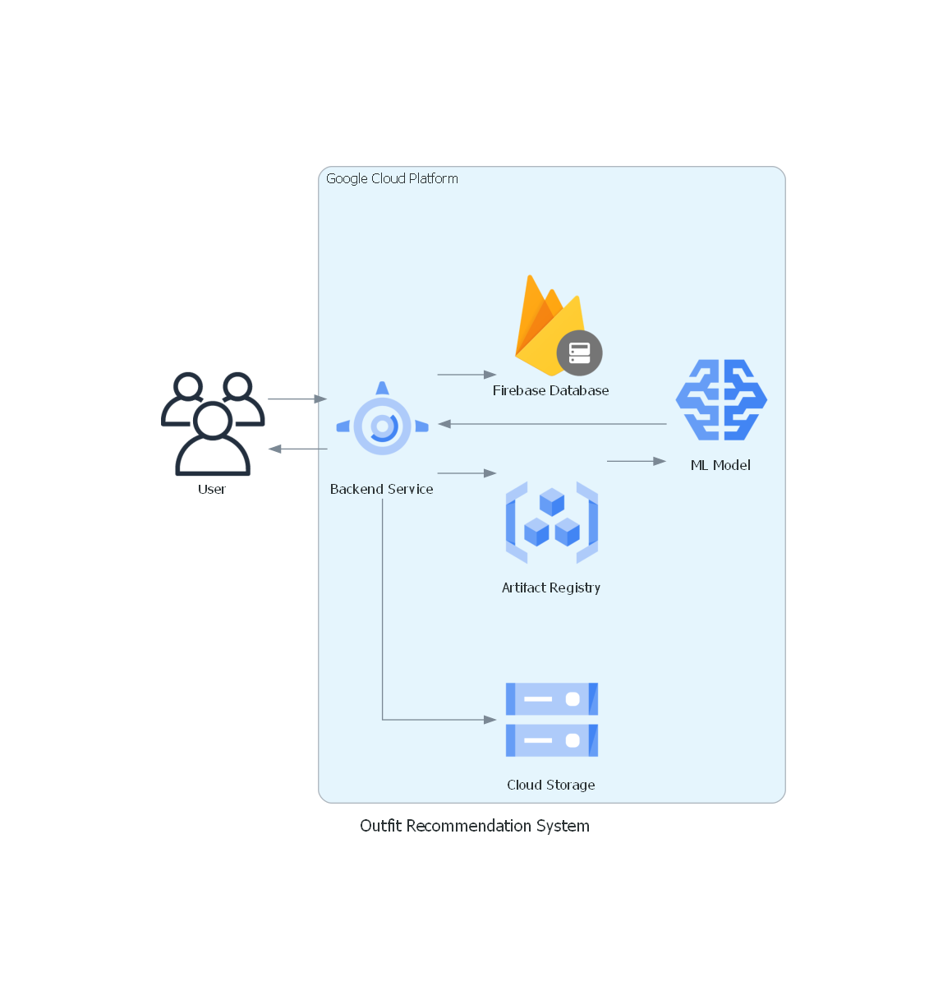

# SmartFit: Cloud Computing Architecture ☁️💻

## Description 📖
Welcome to the **Cloud Computing** branch of the **SmartFit** project! This part focuses on deploying the ML model and managing the backend services that support the SmartFit app. Our goal is to provide a scalable, fast, and secure cloud solution. 🚀

## Team Members 👥
- **(CC) C511B4KY1310** – Fachrio Raditya – Institut Teknologi dan Bisnis Bina Sarana Global
- **(CC) C128B4KY0737** – Aurio Hendrianoko Rajaa – Politeknik Negeri Jakarta

## Cloud Architecture 🏗️
Below is a diagram showing how we deploy the ML model and handle the backend services for SmartFit.

## Steps We Took 📝
- **Deploying the ML Model**: The trained model is deployed using **Google Cloud Storage**.
- **Backend Services**: All requests for clothing recommendations are processed through **APP Engine**.
- **User Data**: User data is securely stored using **Firebase** and **Firebase Authentication** 🔒.

## Technologies Used 🛠️
- **Google Cloud Platform**: Vertex AI, App Engine, Firebase, Container Registry
- **Firebase**: For user authentication and data storage
- **Machine Learning**: **TensorFlow** for training and model deployment
- **Version Control**: **Git**, **GitHub**

## Cloud Workflow 🌐
1. **Step 1**: The ML model is deployed through **Google AI Platform**.
2. **Step 2**: The model is stored in **Cloud Storage** and **Artifact Registry**.
3. **Step 3**: **Cloud Run** handles backend requests, which interact with **Firebase** for user data.

## Challenges & Solutions ⚠️
- **Model Deployment Issues**: We use **Cloud Run** to ensure scalable and serverless deployment.
- **Data Privacy Concerns**: User data is securely stored using **Firebase** 🔐.

## Conclusion 🌟
We hope this **Cloud Computing** solution will enable SmartFit to deliver a faster and better experience for users. Feel free to ask questions or contribute to this branch! 💬
